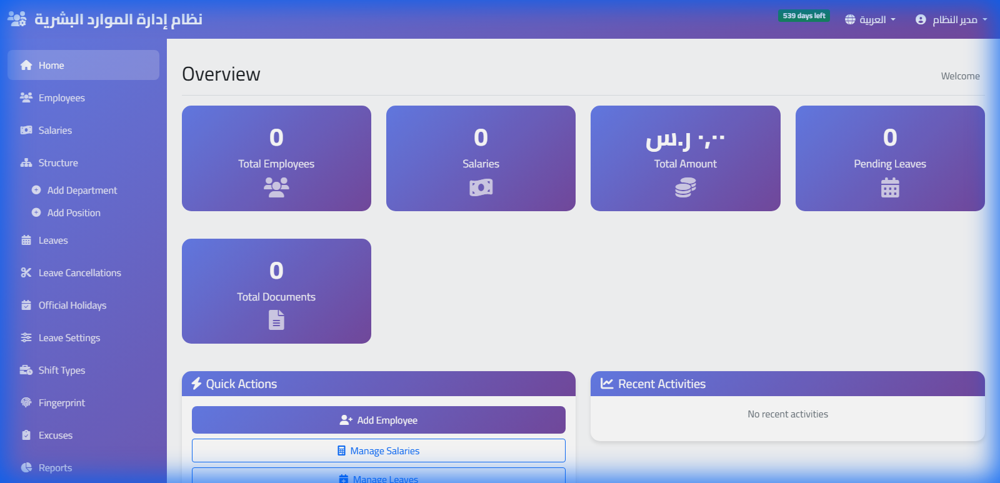
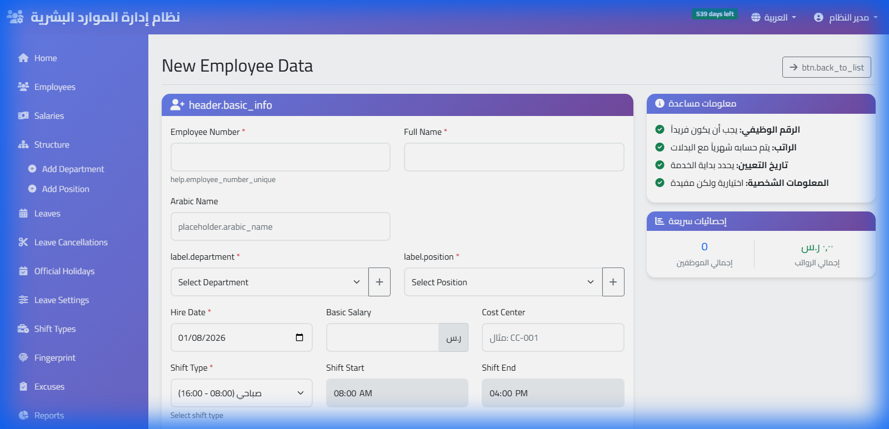

# ١ — ابدأ من هنا

بعد التسجيل مباشرةً. خمس خطوات تفصلك عن أول تقرير حضور صحيح.

---

## الترتيب يهمّ

اتّبعه كما هو. إضافة الموظفين **قبل** ربط الجهاز يوفّر عليك مطابقة أرقام
يدويًّا لاحقًا.

| | الخطوة | الوقت |
|---|---|---|
| ١ | ادخل نظامك واضبط بيانات الشركة | دقيقتان |
| ٢ | أضف الموظفين | حسب العدد |
| ٣ | [اربط جهاز البصمة](02-device.md) | ١٠ دقائق |
| ٤ | اسحب بصمات الموظفين إلى النظام | دقيقة |
| ٥ | اضبط الدوام والإجازات | ١٥ دقيقة |

---

## ١. بيانات الشركة

من **الإعدادات ← بيانات الشركة**: الاسم والشعار والعملة والمنطقة الزمنية.

**المنطقة الزمنية ليست تفصيلًا شكليًّا.** ساعة النظام هي مصدر طوابع الحضور،
وانحرافها يزيح ساعات العمل، وساعات العمل تدخل الأجر. اضبطها قبل أول بصمة.

---

## ٢. الموظفون

من **الموظفون ← إضافة موظف**. المطلوب فعلًا: الاسم، الرقم الوظيفي، تاريخ
التعيين، الراتب الأساسي.

**الرقم الوظيفي هو حلقة الوصل مع جهاز البصمة.** اجعله مطابقًا لرقم
المستخدم على الجهاز. لو كان الموظف رقم `7` على الجهاز، اجعله `7` هنا —
وإلّا وصلت بصماته دون أن تُنسب إليه.

ولو كان عندك عدد كبير، استعمل **استيراد من Excel** بدل الإدخال يدويًّا.

---

## ٣. جهاز البصمة

[الخطوات كاملة هنا](02-device.md). لا تتخطّاها: كل ما بعدها يعتمد عليها.

---

## ٤. اسحب البصمات

من **أجهزة البصمة ← مزامنة الكل من الجهاز**.

هذه الخطوة تنقل بصمة كل موظف من الجهاز إلى نظامك. تأخذ دقيقة، وتوفّر عليك
يومًا كاملًا لو تلف الجهاز لاحقًا. [التفاصيل](02-device.md#احفظ-بصمات-موظفيك-عندك).

---

## ٥. الدوام والإجازات

من **الإعدادات**:

- **الشفتات** — أوقات الدوام، والسماح بالتأخير، ومتى تُحتسب الساعة إضافية.
- **الإجازات** — الأنواع والأرصدة السنوية ومن يوافق.
- **العطل الرسمية** — حتى لا تُحتسب غيابًا.

اضبط شفتًا واحدًا صحيحًا أولًا وجرّبه يومًا، ثم أضف البقيّة.

---

## بعد أسبوع

افتح **التقارير ← ملخّص الحضور** وقارن أسبوعًا كاملًا بما لديك اليوم.
هذه أفضل طريقة لاكتشاف إعداد خاطئ — رقم وظيفي غير مطابق، أو شفت بأوقات
غير صحيحة — وأنت ما زلت في فترة التجربة.

---

## فترة التجربة

ثلاثون يومًا كاملة بكل المميزات. بياناتك تبقى كما هي بعد الاشتراك — لا
تُعيد شيئًا من البداية.
