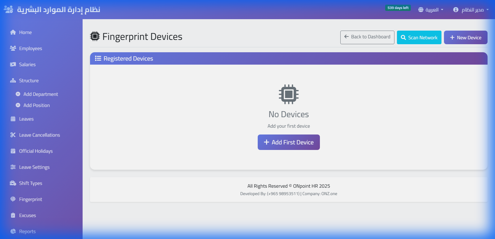

# ٢ — ربط جهاز البصمة

أهم خطوة في التركيب. بعدها يعمل الحضور وحده.

---

## ما الذي ستفعله

تدخل على إعدادات الجهاز وتكتب فيه عنوان نظامك. بعدها **الجهاز هو من يتصل
بنا** — لا العكس.

وهذا يعني عمليًّا:

- لا تحتاج عنوان IP ثابتًا من مزوّد الإنترنت.
- لا تحتاج فتح أي منفذ في راوتر الشركة.
- لا تحتاج تشغيل برنامج على حاسب في المكتب يبقى مفتوحًا.

يكفي أن يكون للجهاز **اتصال إنترنت عادي**.

---

## قبل أن تبدأ

جهّز شيئين:

| | مثال |
|---|---|
| عنوان نظامك | `sharikati.onz.one` — كما ظهر لك بعد التسجيل |
| الرقم التسلسلي للجهاز | مطبوع خلف الجهاز، وتجده في `القائمة ← معلومات النظام` |

الجهاز يجب أن يكون من نوع **ZKTeco** يدعم وضع **ADMS** (يسمّى في بعض
القوائم Cloud Server أو Comm. ← Ethernet ← Cloud). معظم أجهزة ZKTeco
الحديثة تدعمه.

> أجهزة العلامات الأخرى (Hikvision، Dahua، Suprema) **غير مدعومة حاليًّا**.

---

## الخطوات على الجهاز

تختلف مسمّيات القوائم قليلًا بين الموديلات، لكن الترتيب واحد:

**١.** اضغط `M/OK` لفتح القائمة، ثم `Comm.` أو `الاتصال`.

**٢.** ادخل على `Ethernet` وتأكّد أن الجهاز متصل بالشبكة ويأخذ عنوانًا
(`DHCP` مفعَّل يكفي).

**٣.** ارجع وادخل على `Cloud Server Setting` أو `ADMS`.

**٤.** اضبط الحقول:

| الحقل | القيمة |
|---|---|
| `Server Address` / عنوان الخادم | عنوان نظامك — مثلًا `sharikati.onz.one` |
| `Server Port` / المنفذ | `80` |
| `Enable Domain Name` | مفعَّل |
| `Enable Proxy Server` | معطَّل |

**٥.** احفظ، ثم أعد تشغيل الجهاز من `القائمة ← إعادة التشغيل`.

---

## لماذا المنفذ 80 وليس غيره

بروتوكول ZKTeco ينصّ على أن المنفذ الافتراضي هو **80**. وحين تضبط عنوانًا
بلا منفذ، يستخدم الجهاز 80 من تلقاء نفسه.

نحن نستقبل على 80 ونحوّل إلى الاتصال المشفّر داخليًّا، فلا تحتاج ضبط شيء
آخر. **لا تكتب منفذًا مثل 8081 أو 5000** — تلك منافذ داخلية عندنا ولا
تُستعمل من الجهاز.

---

## كيف تتأكّد أنه اشتغل

بعد إعادة التشغيل بدقيقة أو دقيقتين:

١. ادخل نظامك ← **أجهزة البصمة**.
٢. يجب أن يظهر جهازك برقمه التسلسلي وحالة **متصل**.
٣. بصم بإصبعك على الجهاز، وحدّث الصفحة — يجب أن تظهر البصمة خلال ثوانٍ.

إن ظهرت البصمة، انتهى التركيب.

---

## احفظ بصمات موظفيك عندك

هذه الخطوة هي التي تفرّق، ويتخطّاها كثيرون:

من **أجهزة البصمة ← مزامنة الكل من الجهاز**، اسحب بصمات الموظفين المسجّلة
على الجهاز إلى نظامك.

بعدها، لو تلف الجهاز أو أردت إضافة جهاز ثانٍ في فرع آخر، تُرسَل البصمات
إليه من النظام بضغطة. أما إن لم تفعل، فبصمات موظفيك موجودة **على الجهاز
وحده** — وعطل الجهاز يعني إعادة تسجيل الجميع واحدًا واحدًا.

افحص العمود في قائمة الموظفين: كل من مكتوب أمامه **محفوظ** بصمته آمنة
عندك.

---

## إن لم يظهر الجهاز

| الحالة | ابدأ من |
|---|---|
| الجهاز لا يظهر إطلاقًا | تأكّد من كتابة العنوان حرفًا بحرف، وأن المنفذ `80`، وأن `Enable Domain Name` مفعَّل |
| يظهر «غير متصل» | افحص إنترنت الجهاز: `Comm. ← Ethernet` — هل أخذ عنوانًا؟ جرّب كابل شبكة آخر |
| متصل ولا تصل بصمات | تأكّد أن الموظف مسجَّل على الجهاز نفسه، وأن رقمه في الجهاز مطابق لرقمه في النظام |
| يعمل ثم ينقطع | الأغلب انقطاع إنترنت أو إعادة تشغيل الراوتر — الجهاز يعيد المحاولة تلقائيًّا ويرسل ما تجمّع |

ولو بقي الأمر، راسلنا بالرقم التسلسلي وموديل الجهاز ووقت آخر بصمة وصلت.

---

## أكثر من فرع

كرّر الخطوات على كل جهاز بنفس العنوان. الأجهزة كلها تصبّ في نظام واحد،
وتظهر البصمات مع اسم الفرع الذي جاءت منه.

وبعد إضافة جهاز جديد، أرسل إليه بصمات الموظفين من النظام بدل تسجيلهم عليه
من جديد.
