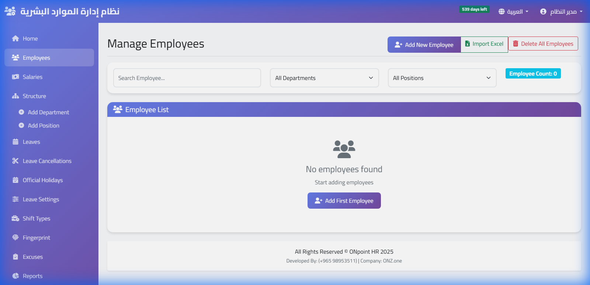
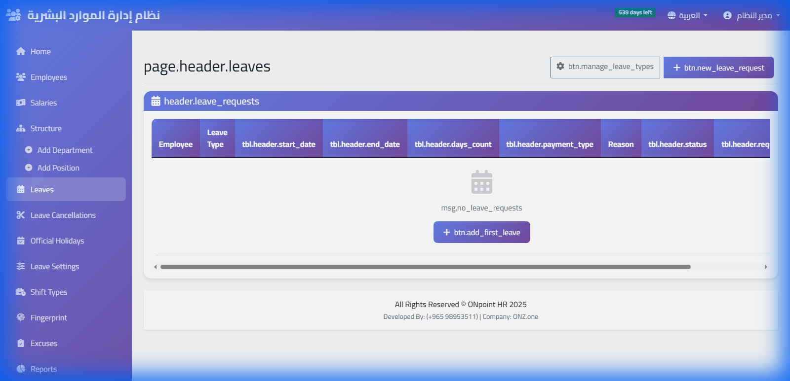
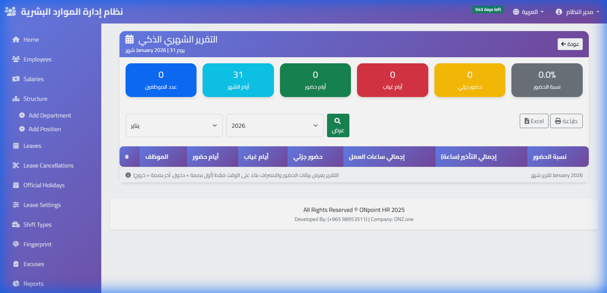

# ٤ — الاستخدام اليومي

---

## لوحة اليوم

أول ما تفتح النظام: من حضر، ومن تأخّر، ومن لم يبصم بعد — لليوم الجاري.

البصمات تصل **لحظة حدوثها**، لا بعد مزامنة كل بضع دقائق. فما تراه هو
الواقع الآن.

---

## الحضور

من **الحضور** تستعرض بالتاريخ أو بالموظف أو بالقسم.

### البصمة الناقصة

موظف بصم دخولًا ولم يبصم خروجًا. يحدث لأسباب عادية: خروج لمهمّة، أو نسيان،
أو انقطاع الجهاز.

النظام يعلّمها ولا يخمّن ساعات العمل من عنده — لأن تخمينًا خاطئًا يدخل
الأجر. عالجها من **الحضور ← تعديل**، ويبقى أثر التعديل مسجَّلًا: من عدّل
ومتى وما القيمة قبله.

### الأعذار

من **أعذار الحضور** تسجّل مهمّة عمل خارجية أو إذنًا مسبقًا، فلا تُحتسب
تأخيرًا أو غيابًا.

### التقارير الذكية

تقارير جاهزة تغنيك عن التصدير إلى Excel:

- **أول وآخر بصمة** — لمن يبصم أكثر من مرّتين يوميًّا.
- **ملخّص شهري** — الحضور والغياب والتأخير لكل موظف في صفحة واحدة.
- **أكثر من يومين تأخير** — من يحتاج متابعة.
- **التواجد اليومي** — من كان موجودًا فعليًّا في وقت معيّن.

كلها قابلة للطباعة والتصدير.

---

## الإجازات

الموظف يقدّم الطلب، والمدير يوافق أو يرفض، والرصيد يُخصم تلقائيًّا.

الأرصدة والأنواع تُضبط مرة واحدة من **الإعدادات ← الإجازات**، ويُراعى
فيها ما ينصّ عليه قانون العمل. راجعها في أول شهر.

---

## الرواتب

من **الرواتب ← كشف الشهر**: يُحسب الأساسي والبدلات والخصومات والإضافي
والصافي.

**قبل اعتماد الكشف**، راجع البصمات الناقصة أولًا — ساعات عمل ناقصة تعني
أجرًا ناقصًا، وتصحيحها بعد الاعتماد أصعب بكثير.

قسائم الرواتب تُطبع فرادى أو دفعةً واحدة.

---

## نهاية الخدمة

من **نهاية الخدمة**، تُحسب المكافأة على مدّة الخدمة والأجر الأخير وسبب
انتهاء العلاقة، وفق القواعد المعمول بها في الخليج.

النتيجة **مفصَّلة لا رقمًا وحيدًا**: ترى كيف احتُسبت كل سنة خدمة، فتراجعها
مع الموظف عند الحاجة.

---

## الوثائق

ارفع لكل موظف عقده وإقامته وشهاداته من **الوثائق**. يُنبّهك النظام قبل
انتهاء أي وثيقة لها تاريخ انتهاء — قبل أن تفاجئك.

---

## الصلاحيات

من **المستخدمون** تنشئ حسابات لفريقك وتحدّد ما يراه كلٌّ منهم.

**لا تشارك حساب المدير.** كل تعديل يُسجَّل باسم صاحبه، وحساب مشترك يُلغي
فائدة السجل تمامًا حين تحتاجه.

---

## نصائح من الاستخدام الفعلي

**راجع «البصمات الناقصة» أسبوعيًّا** لا آخر الشهر. الموظف يتذكّر يوم أمس
ولا يتذكّر يوم الثالث من الشهر الماضي.

**اسحب البصمات إلى النظام بعد كل موظف جديد.** تسجيله على الجهاز وحده يعني
أنه خارج نسختك الاحتياطية.

**احذف الموظف المغادر من الجهاز من النظام** لا من الجهاز مباشرةً — تُحفظ
بياناته وسجلّه، ويُحذف من كل الأجهزة دفعة واحدة.
